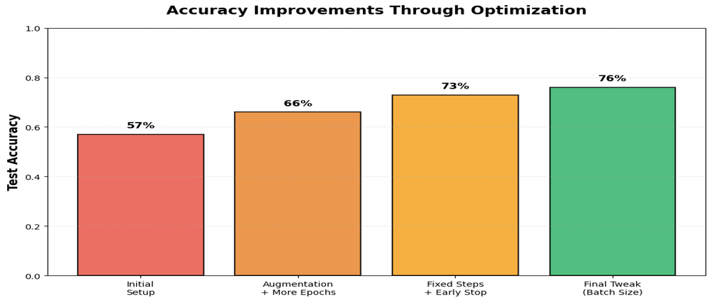
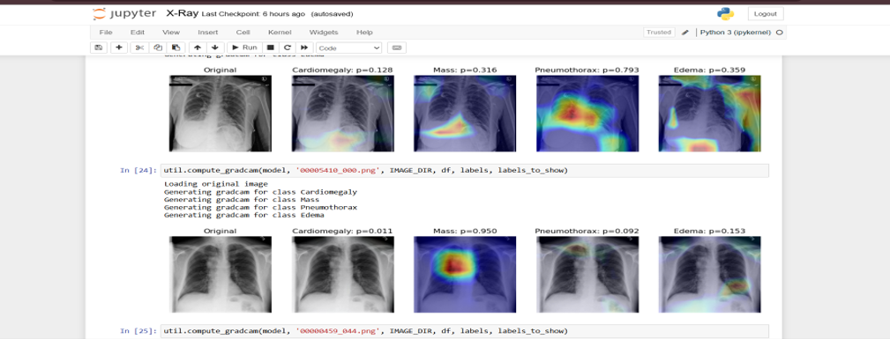

# Chest X-ray Disease Classification Using Deep Learning

**Author:** Sayali Lohokare
**Module:** Deep Learning, MSc Computer Science (Software Engineering), Maynooth University

## What this project is about

This project builds a deep learning model that predicts multiple chest diseases from X-ray images.
It uses transfer learning with DenseNet-121 as the backbone, with a custom classification head added
for multi-label prediction across 14 thoracic pathologies.

The notebook `X-Ray.ipynb` shows the full workflow: loading the data, building the model, training it
through several optimisation stages, and evaluating performance — reaching a final test accuracy of
approximately 76%, with a macro AUC of ~0.60 and macro F1-score of ~0.29 on the held-out test set.

A full write-up of the methodology, related work, and results analysis is included as a research
paper (`Chest-Xray-Research-Paper.pdf`) in this repo.

📹 **Video walkthrough:** [Watch Here](https://drive.google.com/file/d/1NKCEC0n-mftqpbCJN4ALbz5TO51RWRG5/view?usp=sharing) — a short screen recording explaining the notebook, training
process, and final results.

## What's included here

- `X-Ray.ipynb` — main Jupyter notebook with the full workflow and saved outputs from training runs.
- `util.py` — helper functions imported by the notebook.
- `train-small.csv`, `valid-small.csv`, `test.csv` — CSV files defining the train/validation/test
  splits and image paths.
- `Chest-Xray-Research-Paper.pdf` — full written report covering background, dataset, methodology,
  results, and ethical considerations.
-  `Chest-Xray-Disease-Classification.pptx` — presentation summary of the project, methodology, and results.

## About the dataset

This project uses the public **NIH Chest X-ray (ChestX-ray14)** dataset, a collection of 112,120
frontal chest X-rays from 30,805 patients, labelled across 14 thoracic conditions.

Due to file size, the raw image dataset, pretrained model weights, and dataset metadata file are
**not included** in this repository. To fully re-run the project:

1. Download the NIH Chest X-ray dataset from the official [NIH source](https://nihcc.app.box.com/v/ChestXray-NIHCC) or [Kaggle](https://www.kaggle.com/datasets/nih-chest-xrays/data).
2. Extract the images into a folder structured as:
   ```
   nih/
     images/
       00000001_000.png
       ...
   ```
3. Make sure the image paths in `train-small.csv`, `valid-small.csv`, and `test.csv` point to this
   folder (or update the CSVs to match your local file structure).

## How to run

1. Create a Python environment (Anaconda or venv).
2. Install the main libraries:
   ```bash
   pip install tensorflow keras numpy pandas matplotlib scikit-learn
   ```
3. Place `X-Ray.ipynb`, `util.py`, and the three CSV files in the same directory, with the NIH
   images set up as described above.
4. Open `X-Ray.ipynb` in Jupyter and run the cells from top to bottom.

The notebook will load and preprocess the data, build the DenseNet-121-based model, train it through
several optimisation steps (data augmentation, early stopping, batch-size tuning), and evaluate on
the test set with accuracy and AUC plots.

## Results summary

| Stage                              | Test Accuracy |
|------------------------------------|---------------|
| Initial baseline                   | 57%           |
| + Augmentation & extended training | 66%           |
| + Fixed steps & early stopping     | 73%           |
| Final tuned model                  | 76%           |


Final model: macro AUC ≈ 0.60 across 14 pathologies, macro F1-score ≈ 0.29 (class-specific thresholds).



## Example output: Grad-CAM explainability

The heatmaps below show which regions of the X-ray the model focused on when predicting each pathology — a qualitative check that the model is using clinically plausible areas rather than spurious artefacts.



## Note

Even without re-running training, the notebook can be opened directly to see the full code, training
logs, final metrics, and plots. The video walkthrough above gives a guided tour of these results.
